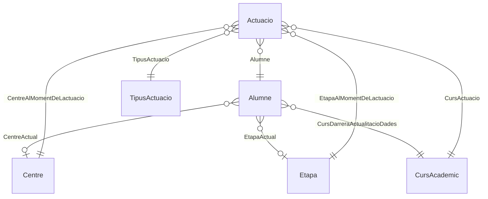

# Arquitectura d'EAP Recull

Mapa global de l'aplicació: què hi ha, com encaixa i quines regles no s'han de trencar.
Escrit per fer de **context d'entrada** per a qualsevol tasca —humana o d'IA— sobre aquest
repositori. Els detalls d'implementació viuen als documents que s'indexen a §1.

---

## 0. Què és l'aplicació

Aplicació **d'escriptori, monousuari i local** per a la gestió d'actuacions del personal
d'un EAP (Equip d'Assessorament Psicopedagògic). No té servidor, ni xarxa, ni comptes
d'usuari: tot passa dins del procés i les dades es desen en un fitxer SQLite del disc de
l'usuari.

| | |
|---|---|
| **Plataforma** | .NET 10 · Avalonia UI 11 · ReactiveUI |
| **Persistència** | SQLite (EF Core 10), fitxer únic |
| **Distribució** | *self-contained* per a win-x64, linux-x64, osx-arm64 i osx-x64 |
| **Base de dades** | `<app>/Data/BaseDeDades.db` — en `DEBUG`, `~/Documents/EapRecullData/BaseDeDades.db` |
| **Sortides generades** | `~/Documents/EapRecullData/Reports/` (Word i Excel) |
| **Idioma del codi** | català: noms, comentaris, missatges d'error i textos d'UI |
| **Llicència** | MIT |

Conseqüències arquitectòniques d'aquestes premisses, que expliquen bona part de les
decisions del repositori:

- **No hi ha capa d'autenticació ni d'autorització.** Cap operació pregunta qui la fa.
- **No hi ha concurrència entre usuaris**, però **sí entre finestres**: diverses finestres
  poden mirar les mateixes dades alhora, i és el que motiva el bus de canvis (§5).
- **L'única frontera de procés és el fitxer .db.** No hi ha serialització a JSON, ni API,
  ni contractes versionats cap enfora.

---

## 1. Índex de la documentació

Aquest fitxer és el mapa; els altres són el terreny. Segons la tasca:

| Document | Cobreix | Quan llegir-lo |
|---|---|---|
| **`ARQUITECTURA.md`** (aquest) | Visió global, capes, dependències, fluxos, invariants | Sempre primer |
| **`agents.md`** | Recepta pas a pas per fer un CRUD complet, de l'entitat a la vista; validacions; accions post-escriptura | Abans d'afegir una entitat o una operació de negoci |
| **`UI.ER.AvaloniaUI/readme.md`** | Arquitectura de la presentació en detall: `IWindowFactory`, `IServiceFactory`, diàlegs, AXAML, paleta, tests d'UI, invariants i deutes | Abans de tocar qualsevol cosa d'UI |
| **`README.md`** | Compilar, empaquetar i publicar versions (tags + GitHub Actions), FAQ d'usuari | Abans de fer un *release* |
| **`Upgrade.md`** | Registre de la migració .NET 6 → .NET 10 i del patró MVVM resultant | Context històric; per entendre per què una cosa és com és |
| **`docs/release_notes.md`** | Notes de versió | Publicació |

---

## 2. Mapa de la solució

15 projectes. Deu formen l'aplicació, dos són tests i dos són eines de línia d'ordres.

```
                        ┌──────────────────────────┐
   PRESENTACIÓ          │    UI.ER.AvaloniaUI      │  vistes .axaml, code-behind,
                        │  (composition root, exe) │  WindowFactory, tema, logging
                        └────────────┬─────────────┘
                                     │
                        ┌────────────┴─────────────┐
                        │     UI.ER.ViewModels     │  ViewModels ReactiveUI.
                        │   (no coneix Avalonia)   │  Només veu BusinessLayer.Abstract
                        └────────────┬─────────────┘
                                     │
   NEGOCI      ┌─────────────────────┴──────────┐   ┌──────────────────────────┐
               │    BusinessLayer.Abstract      │◄──┤      BusinessLayer       │
               │ contractes IXxx, OperationResult│   │ 30 operacions + classes  │
               │ genèrics, bus de canvis        │   │ base BL*, RuleChecker    │
               └───────┬─────────────────┬──────┘   └────────────┬─────────────┘
                       │                 │                       │
   TRANSFERÈNCIA  ┌────┴────┐      ┌─────┴────┐         ┌────────┴────────┐
                  │  DTO.i  │      │  DTO.o   │◄────────┤ DTO.Projections │
                  │ (entrada)│     │ (sortida)│         │ Model → DTO.o   │
                  └────┬────┘      └─────┬────┘         └────────┬────────┘
                       │                 │                       │
   DADES               │                 │            ┌──────────┴──────────┐
                       │                 │            │      DataLayer      │
                       │                 │            │ AppDbContext, SQLite,│
                       │                 │            │ migracions, SQL propi│
                       │                 │            └──────────┬──────────┘
                       │                 │            ┌──────────┴──────────┐
                       │                 │            │DataModels.Configuration│
                       │                 │            │   (Fluent API EF)    │
                       │                 │            └──────────┬──────────┘
                       │                 │            ┌──────────┴──────────┐
                       │                 │            │     DataModels      │
                       │                 │            │  6 entitats EF      │
                       │                 │            └──────────┬──────────┘
                  ┌────┴─────────────────┴──────────────────────┴────┐
   BASE           │              CommonInterfaces                    │
                  │  IId · IEtiquetaDescripcio · IActiu · IModel     │
                  │        (no depèn de res, ni de EF)               │
                  └─────────────────────────────────────────────────┘
```

### Responsabilitats

| Projecte | Responsabilitat | Depèn de |
|---|---|---|
| `CommonInterfaces` | Contractes mínims que travessen totes les capes: `IId`, `IEtiquetaDescripcio`, `IActiu`/`IActiuRW`, `IModel`, `StringExtensions` | — |
| `DataModels` | Les 6 entitats del domini, amb les propietats calculades `Etiqueta`/`Descripcio` | CommonInterfaces |
| `DataModels.Configuration` | Configuració EF Core per entitat (Fluent API), aplicada per assembly | DataModels, EF Core |
| `DataLayer` | `AppDbContext`, cadena de connexió i ubicació del fitxer, migracions, funcions SQL pròpies, registre DI de dades | DataModels.Configuration, EF Core Sqlite |
| `DTO.i` | Paràmetres d'entrada de les operacions (`*CreateParms`, `*UpdateParms`, `*SearchParms`, `IdParms`…) | CommonInterfaces |
| `DTO.o` | DTOs de sortida: el que la UI pinta. Immutables, amb `Etiqueta` i `Descripcio` ja calculades | CommonInterfaces |
| `DTO.Projections` | Les `Expression<Func<Model, Dto>>` que EF tradueix a SQL. **Únic lloc on es fa Model → DTO** | DataModels, DTO.o |
| `BusinessLayer.Abstract` | Contractes de les 30 operacions, genèrics (`ISet`, `ICreate`, `IUpdate`, `IDelete`, `IActivaDesactiva`), `OperationResult(s)`, `BrokenRule`, i el bus de canvis (`INotificadorDeCanvis`, `CanviDeDomini`, `Referencies`) | CommonInterfaces, DTO.i, DTO.o |
| `BusinessLayer` | Implementació: classes base `BLOperation`/`BLSet`/`BLCreate`/`BLUpdate`/`BLDelete`/`BLActivaDesactiva`/`BLReport`/`BLBatchOperation`, `RuleChecker`, les 30 operacions, plantilles d'informe | tot l'anterior + EF Core, ClosedXML, EPPlus, SharpDocx, Serilog |
| `UI.ER.ViewModels` | ViewModels ReactiveUI, `ServiceFactory`, convertidors, contractes de diàleg | **només** `BusinessLayer.Abstract` + ReactiveUI |
| `UI.ER.AvaloniaUI` | Executable: vistes AXAML, `WindowFactory`, tema, helpers, logging i **composition root** | BusinessLayer, DataLayer, UI.ER.ViewModels, Avalonia |
| `BusinessLayer.Integration.Test` | Tests d'integració de negoci sobre SQLite en memòria | BusinessLayer, DataLayer |
| `UI.ER.AvaloniaUI.Test` | Tests estructurals de la UI (convencions, registre DI, bindings, bus) | UI.ER.AvaloniaUI, UI.ER.ViewModels |
| `ImportData` | Eina CLI: importa `Data/Importacio.xlsx` (export d'EAP Actua) | BusinessLayer, DataLayer |
| `CreateDemoData` | Eina CLI: genera dades de demostració | BusinessLayer, DataLayer |

### Regles de dependència (no trencar)

1. **`CommonInterfaces` no depèn de res.** Ni d'EF, ni de Rx, ni de res de tercers.
2. **`BusinessLayer.Abstract` no coneix EF Core ni System.Reactive.** És per això que el bus
   de canvis és un `event` i no un `IObservable`: el costat UI l'adapta amb
   `Observable.FromEvent` (`UI.ER.ViewModels/Services/NotificadorExtensions.cs`).
3. **`UI.ER.ViewModels` no referencia Avalonia ni `BusinessLayer` (la implementació).**
   Un ViewModel només veu contractes. Això és el que fa que els ViewModels es puguin
   exercitar sense plataforma gràfica.
4. **Els models d'EF no surten mai de `BusinessLayer`.** El que travessa cap a la UI són
   DTOs de `DTO.o`. (Excepció controlada: les projeccions passen el model sencer al
   constructor del DTO, i per això `Referencies` només llegeix l'`Id` d'aquestes
   propietats — veure §5.)
5. **`UI.ER.AvaloniaUI` referencia `BusinessLayer` i `DataLayer` només per compondre el
   contenidor.** Cap vista ni cap ViewModel n'usa els tipus directament.

---

## 3. El domini

Sis entitats. Cap d'elles té esborrat lògic tret d'`Actuacio`, que és l'única que es pot
esborrar de debò; la resta s'activen i es desactiven (`IActiu`).



| Entitat | Paper | Notes |
|---|---|---|
| `Alumne` | Subjecte de les actuacions | Té camps *cache*: `NombreTotalDactuacions`, `DataDarreraActuacio`, `DataDarreraModificacio` |
| `Actuacio` | El fet registrat: qui, què, quan, on, quant | **Fotografia històrica**: desa centre, etapa i nivell *del moment*, no els actuals de l'alumne |
| `Centre` | Centre educatiu | `Codi` + `Nom` |
| `Etapa` | Infantil, Primària, ESO… | `SonEstudisObligatoris` |
| `CursAcademic` | Curs escolar | `AnyInici` + `Nom` |
| `TipusActuacio` | Catàleg d'actuacions | `Codi` + `Nom` |

**La decisió de disseny central del domini**: `Actuacio` duplica el centre, l'etapa i el
nivell que l'alumne tenia en aquell moment. Un alumne que canvia de centre no reescriu el
seu historial. Qualsevol canvi que ho "normalitzi" trencaria l'informe d'expedient i el
pivot.

**Convencions transversals de les entitats:**

- Tota entitat implementa `IId` i `IEtiquetaDescripcio`: `Etiqueta` és el text curt que es
  veu a llistes i lookups, `Descripcio` el subtítol. Són **propietats calculades del
  model**, i les projeccions les passen ja resoltes al DTO.
- Totes menys `Actuacio` implementen `IActivable` (`EsActiu` + `SetActiu()`/`SetInactiu()`).
- El nom del tipus és significatiu: `Referencies.EntitatDe()` casa `DataModels.Models.Alumne`,
  `DTO.o.DTOs.Alumne` i l'enum `Entitat.Alumne` **pel nom** (§5).

---

## 4. Els quatre camins d'una operació

Tota la lògica de negoci passa per una de quatre classes base. Cadascuna té la seva forma i
el seu contracte, i triar-ne la correcta és el 90% de l'encert en afegir una funcionalitat.

| Camí | Classe base | Contracte | Retorna | Publica al bus? |
|---|---|---|---|---|
| **Lectura** | `BLSet<TModel,TParm,TDto>` | `ISet<TParm,TDto>` | `OperationResults<TDto>` (dades + total + paginació) | No |
| **Escriptura** | `BLCreate` / `BLUpdate` / `BLDelete` / `BLActivaDesactiva` | `ICreate` / `IUpdate` / `IDelete` / `IActivaDesactiva` | `OperationResult<TDto>` | Sí, amb les entitats afectades |
| **Informe** | `BLReport<TResult>` | contracte propi amb `Run(...)` | `OperationResult<SaveResult>` (path del fitxer) | No |
| **Massiu** | `BLBatchOperation<TResult>` | contracte propi | `OperationResult<TResult>` | Sí, `CanviDeDomini.Tot` |

### Lectura

```
ViewModel → ISet.FromPredicate(SearchParms)
          → BLSet.GetModels(parms)         ← el filtre, en IQueryable
          → .Skip/.Take                    ← paginació si TParm : IPaginated (per defecte 2000)
          → .Select(ToDto)                 ← DTO.Projections, traduït a SQL
          → OperationResults<TDto>
```

Cap `ToList()` prematur: el filtre i la projecció viatgen a SQLite. La cerca de text passa
per la funció SQL pròpia `Conte()` (§6).

### Escriptura

`BLCreate.Create()` orquestra sempre la mateixa seqüència, i cada operació concreta només
omple els ganxos:

```
PreInitialize(parm)      ← validacions: RuleChecker
InitializeModel(parm)    ← construir el model; Perfection<T>(id) per resoldre FKs
context.Add(model)
PostAdd(model, parm)     ← efectes col·laterals (p. ex. incrementar el cache de l'Alumne)
SaveChangesAsync()
Model2Dto(model)         ← rellegeix per la projecció
Notificador.Publica(Alta, Referencies.De(dto))
```

`BLUpdate.Update()` hi afegeix dues coses importants: captura el **DTO previ** abans de
tocar res —perquè moure una actuació d'un alumne a un altre ha de refrescar tots dos— i
crida `ResetReferences(model)` abans dels ganxos.

**Gestió d'errors, uniforme a totes les escriptures:** una `BrokenRuleException` es
converteix en `OperationResult` amb `BrokenRules` omplertes (error de negoci, esperat);
qualsevol altra excepció es registra amb Serilog i es reempaqueta. **Cap operació de negoci
propaga excepcions crues a la UI.**

### Validacions

`RuleChecker<TParm>` (i `RuleChecker<TModel,TParm>` per a les modificacions) és una llista
de predicats amb missatge; el predicat **cert vol dir regla trencada**. S'omple a
`PreInitialize`/`PreUpdate` i es dispara amb `await checker.Check()`, que llança
`BrokenRuleException` a la primera que peta. Admet predicats síncrons i asíncrons (per
exemple, comprovar duplicats contra la base de dades).

### Informes

`BLReport` centralitza el `try/catch` i el càlcul del path de sortida
(`~/Documents/EapRecullData/Reports/<prefix>_<timestamp>.<ext>`). N'hi ha dos:

- **`AlumneInforme`** — expedient de l'alumne en Word, amb **SharpDocx** i la plantilla
  `BusinessLayer/Assets/Templates/AlumneInforme.cs.docx`. SharpDocx compila la plantilla
  amb Roslyn en temps d'execució, i **això és el que obliga a `IncludeAllContentForSelfExtract`**
  al csproj de la UI: amb `PublishSingleFile`, `Assembly.Location` torna buit i falla.
- **`PivotActuacions`** — taula dinàmica d'actuacions en Excel, amb **EPPlus**.

---

## 5. El bus de canvis de domini

És el mecanisme transversal més característic de l'aplicació i el que menys s'endevina
llegint una classe sola. Resol aquest problema: **hi pot haver diverses finestres obertes
mirant les mateixes dades, i una escriptura en una ha de refrescar les altres.**

```
BLCreate/BLUpdate/BLDelete/BLActivaDesactiva
        │  Publica(new CanviDeDomini(Mena, Referencies.De(dto)))
        ▼
  INotificadorDeCanvis  (Singleton, un per aplicació, event pla)
        │
        │  ComObservable()  ← adaptació a Rx, al costat UI
        ▼
  SetViewModelBase   .Where(EnsAfecta).Throttle(300ms).ObserveOn(UI)
        │
        ▼
  RefrescaSilenciosament()  ← repeteix la consulta i pedaça les files per Id:
                              sense Clear(), sense tocar Loading, sense perdre
                              scroll ni selecció
```

**La peça clau és `Referencies`** (`BusinessLayer.Abstract/Generic/Referencies.cs`). Defineix,
per convenció i amb reflexió, què "toca" un DTO:

```
Referencies(dto) = { el propi dto } ∪ { tota propietat IIdEtiquetaDescripcio que exposa }
```

Les dues bandes apliquen la mateixa funció —l'emissor al DTO que acaba d'escriure, el
receptor al que té pintat— i es refresca qui interseca. **Per això no hi ha cap mapa de
dependències escrit a mà.** Detalls que importen:

- Recorre **un sol nivell**, i de les propietats de referència només en llegeix l'`Id`, mai
  l'`Etiqueta`: el valor d'aquestes propietats és el model d'EF, no un DTO.
- La correspondència tipus → `Entitat` és **pel nom, pujant per `BaseType`**. Per això
  `CentreAmbActuacions` resol com a `Centre`.
- Una operació massiva publica `CanviDeDomini.Tot`: no sap què ha tocat, i tothom es
  refresca.
- El notificador s'injecta **per propietat**, no pel constructor
  (`BusinessLayer/DI/Injection.cs`): les operacions són Transient i el bus Singleton, i
  així una operació nova hereta l'emissió pel sol fet d'heretar la classe base.
- El notificador pot ser `null`: una operació construïda a mà en un test no ha de petar.

**Invariant:** cap llista es refresca a mà. Ni un `ReLoadData()` en tancar un diàleg, ni un
`Subject` entre fila i llista. Qui escriu publica; qui pinta escolta.

**En afegir una entitat nova cal donar-la d'alta a l'enum `Entitat`**
(`BusinessLayer.Abstract/Generic/CanviDeDomini.cs`) o les llistes que la pintin no es
refrescaran. Hi ha un test (`EntitatTest`) que ho vigila.

---

## 6. Persistència

### Context i fitxer

- **Un sol `AppDbContext`**, amb `DbSet` per a les sis entitats. La configuració de les
  entitats s'aplica per assembly (`ApplyConfigurationsFromAssembly`), no una a una.
- **`IDbContextFactory<AppDbContext>`, no `DbContext` injectat.** Cada operació de negoci
  crea el seu context de manera mandrosa a `GetContext()` i el disposa amb ella
  (`IBLOperation : IDisposable`). No hi ha unitat de treball compartida entre operacions.
- **Ubicació del fitxer**: `AppOptionsBuilderConf.dataSource`. En `RELEASE`, `Data/` al
  costat de l'executable; en `DEBUG`, `~/Documents/EapRecullData/`. La primera vegada crea
  el directori i hi deixa un fitxer buit amb nom recordatori de fer còpies.
- **La carpeta és `AppOptionsBuilderConf.CarpetaDeDades`**, i hi viu tot el que ha de
  sobreviure a l'executable: la base de dades, el recordatori de còpies i l'`Usuari.ini`
  amb les dades de qui fa servir el programa (`IDadesDeLusuari`, §7). Crear-la és tocar el
  disc: cap `*ConfigureServices` ni cap constructor de servei no hi pot arribar.
### Migracions

`context.Database.Migrate()` s'executa **un cop, després de construir el contenidor**
(`MigraBaseDeDades()`), mai dins del registre de serveis.

**Estat actual** (verificat el 2026-09-04, [#85](https://github.com/ctrl-alt-d/eaprecull/issues/85)):

- Hi ha **una sola migració, `20210821093532_inicial`**, amb l'esquema estable des del
  2021-08-22 — abans de la primera versió publicada (`v20210827`). L'únic canvi posterior
  és el nom de la classe (`inicial` → `Inicial`, commit `1a1d00c`); l'identificador de
  l'atribut `[Migration("20210821093532_inicial")]` no s'ha tocat mai.
- **`EnsureCreated()` no s'ha fet servir mai** en aquest repositori. `.Migrate()` hi és des
  del commit `5ba1ee1` (2021-08-18), anterior a la primera publicació.
- Per tant, **totes les instal·lacions existents tenen `__EFMigrationsHistory`** amb aquesta
  única migració registrada, i el seu esquema coincideix amb el model actual. No hi ha
  *drift*.

> ⚠️ **Deute conegut: no hi ha cap xarxa de seguretat per als canvis d'esquema.**
>
> El warning `PendingModelChangesWarning` està **silenciat** a `AppOptionsBuilderConf`. Si
> es canvia una entitat i no es genera migració, l'aplicació **arrenca sense dir res** i la
> columna que falta peta en runtime, a la primera consulta que la toqui — tant en
> instal·lacions noves com en existents.
>
> A més, `.config/dotnet-tools.json` té **`dotnet-ef` fixat a `6.0.6`** amb el projecte en
> EF Core 10: cal pujar-lo abans de poder generar cap migració.

**Procediment per canviar l'esquema** (afegir una entitat, afegir o treure una propietat
persistida, canviar una relació):

1. Pujar `dotnet-ef` a una versió 10.x: `dotnet tool update dotnet-ef`.
2. Generar una **migració nova**: `dotnet ef migrations add <NomDescriptiu> --project DataLayer --startup-project UI.ER.AvaloniaUI`.
3. **No esmenar mai `inicial`.** Està aplicada a totes les instal·lacions existents: un canvi
   allà queda registrat com a ja fet i no arriba a ningú.
4. **No eliminar `inicial`.** Sense ella, EF troba a `__EFMigrationsHistory` una migració
   aplicada que no coneix.
5. Revisar l'SQL generat: SQLite no sap fer `ALTER COLUMN` ni esborrar columnes sense
   recrear la taula, i EF ho resol amb una taula temporal. Amb dades reals a sobre, val la
   pena mirar-s'ho.
6. Provar-ho **contra una còpia d'una base de dades ja existent**, no només contra una de
   nova. És l'única prova que val.
### Funcions SQL pròpies

A `DataLayer/Sql/`. Són la peça que fa possible la cerca insensible a accents:

| Peça | Què fa |
|---|---|
| `ClauDeCerca` | Redueix un text a la forma comparable: minúscules, sense diacrítics, amb equivalències que la descomposició Unicode no cobreix (`ł→l`, `ø→o`, `ß→ss`, ela geminada, ligatures de PDF…) |
| `PatroLike` | Construeix el patró `LIKE` amb el seu caràcter d'escapada |
| `FuncionsSql.Conte(text, cercat)` | El mètode que s'escriu als `IQueryable` |
| `RegistreDeFuncions` | Ensenya a EF a traduir `Conte()` a `clau_cerca(col) LIKE patro(...) ESCAPE ...` |
| `FuncionsSqliteInterceptor` | Registra les funcions a cada connexió SQLite |

L'interceptor s'enganxa a `AppDbContext.OnConfiguring`, **no** al costat del `UseSqlite`:
així el tenen totes les maneres de construir el context, tests inclosos, sense haver-se'n
de recordar.

---

## 7. Composició i injecció de dependències

### La composition root

Un sol lloc, `App.OnFrameworkInitializationCompleted()`, i tres extensions en ordre
significatiu:

```csharp
_services = new ServiceCollection()
    .DataLayerConfigureServices()      // DbContextFactory
    .BusinessLayerConfigureServices()  // bus + 30 operacions
    .UIConfigureServices()             // vistes, IServiceFactory, ViewModels, WindowFactory
    .BuildServiceProvider()
    .MigraBaseDeDades();               // efecte lateral, fora del registre
```

Les dues eines CLI (`ImportData`, `CreateDemoData`) fan la mateixa cadena sense la part
d'UI: són consumidors de primera del BusinessLayer, i qualsevol canvi al registre de negoci
els ha de continuar servint.

### Tot es registra per convenció, res s'enumera a mà

| Registre | Convenció | Fitxer |
|---|---|---|
| Operacions de negoci | Cada `IXxx` de `BusinessLayer.Abstract.Services` es resol amb `Xxx` de `BusinessLayer.Services`, **pel nom** | `BusinessLayer/DI/Injection.cs` |
| Vistes | Tot `Window` de l'assembly de la UI | `UI.ER.AvaloniaUI/DI/Injection.cs` |
| ViewModels | Tot `ViewModelBase` amb un constructor íntegrament resoluble | idem |
| Vista → ViewModel | `XWindow`/`XUserCtrl` → `XViewModel`, o `[ViewModel(typeof(...))]` | `UI.ER.AvaloniaUI/Services/WindowFactory.cs` |

L'aparellament de negoci es fa **pel nom i no per assignabilitat** perquè hi ha herència
entre implementacions (`CentreSetAmbActuacions : CentreSet`) i més d'una classe compliria
`ICentreSet.IsAssignableFrom(...)`.

### Cicles de vida

| Servei | Vida | Per què |
|---|---|---|
| `IDbContextFactory<AppDbContext>` | Singleton | Estàndard d'EF |
| `INotificadorDeCanvis` | **Singleton** | Un sol bus per a tota l'aplicació |
| `IDadesDeLusuari` | **Singleton** | Un sol `Usuari.ini` per a tota l'aplicació, llegit un cop; el desat n'actualitza la còpia en memòria i tothom la veu |
| Operacions de negoci (`IXxx`) | **Transient** | Són d'un sol ús i `IDisposable`; es consumeixen amb `using var bl = ...` |
| `IServiceFactory` | **Scoped** | És el que fa que l'scope per diàleg alliberi de debò les operacions |
| ViewModels | Transient | — |
| Vistes (`Window`) | **Transient obligatori** | Un `Window` d'Avalonia tancat no es pot reobrir |
| `IWindowFactory` | Singleton | — |

### Fallada ràpida a l'arrencada

Tres validacions peten en arrencar, no dins d'un diàleg:

1. Una `IXxx` de negoci sense la seva `Xxx` → excepció al registre.
2. Una vista sense ViewModel resoluble (ni per convenció ni per atribut) → excepció a
   `ValidaConvencioVistaViewModel()`.
3. Un ViewModel passat a `GetWith<TWindow>()` que no és el que la convenció assigna a la
   finestra → excepció abans d'obrir res.

---

## 8. La presentació, en tres frases

El detall és a **`UI.ER.AvaloniaUI/readme.md`**; aquí, el mínim per orientar-se.

- **Dues meitats**: `UI.ER.ViewModels` (lògica de presentació, sense Avalonia) i
  `UI.ER.AvaloniaUI` (AXAML i plataforma). La frontera és estricta.
- **Dos ports, un per sentit**: de la vista al ViewModel hi ha `IWindowFactory`
  (construeix finestra + ViewModel, obre un **scope de DI per diàleg**); del ViewModel al
  negoci hi ha `IServiceFactory` (`GetBLOperation<T>()` + `Canvis` + `DadesUsuari`), que és l'**única**
  porta i substitueix l'antic service locator estàtic.
- **Cinc ViewModels per entitat**, i les seves vistes correlatives:

  | Sufix | Paper | Classe base de la vista |
  |---|---|---|
  | `*SetViewModel` | Llista amb filtres i paginació | `EntitySetWindow<>` |
  | `*RowViewModel` | Una fila de la llista | `EntityRowUserCtrl<>` |
  | `*CreateViewModel` | Alta | `EntityEditWindow<>` |
  | `*UpdateViewModel` | Modificació | `EntityEditWindow<>` |

  Les llistes hereten de `SetViewModelBase<TRow,TDto>`, que porta la col·lecció, l'estat de
  càrrega, el bucle consulta → files i **el refresc silenciós del bus**.

- **La navegació és declarativa**: `Interaction<TVm, TResultat?>` al ViewModel, i la vista
  la registra amb `RegistraDialeg`. Cap vista fa `new` d'una altra vista; cap vista navega
  des d'un handler de `Click`. El **mode lookup** (`ModeLookup`) reutilitza les mateixes
  llistes com a selectors dins dels formularis.

---

## 9. Tests

Cap test obre una finestra: no hi ha `Avalonia.Headless` al projecte. Els tests d'UI són
**estructurals** —vigilen que les convencions es compleixin— i la validació visual és
manual (hi ha un recorregut mínim documentat a `UI.ER.AvaloniaUI/readme.md` §12).

| Projecte | Què garanteix |
|---|---|
| `BusinessLayer.Integration.Test` | Lectura/escriptura real contra **SQLite en memòria** amb les migracions posades (`EntornDeTest`), integritat de FKs, emissió al bus, la clau de cerca insensible a accents, i que el registre DI es construeix |
| `UI.ER.AvaloniaUI.Test` | Que tota vista té ViewModel resoluble, que les classes base s'usen on toca, que els constructors pont existeixen, que els bindings són compilats, que el registre no s'ha desincronitzat, i que `Referencies`/`Entitat` cobreixen totes les entitats |

`EntornDeTest` manté una **connexió de guàrdia** oberta: una base SQLite en memòria viu
només mentre hi ha alguna connexió, i la factory n'obre i en tanca a cada context.

```bash
dotnet build eaprecull.sln --no-incremental   # --no-incremental cal si s'ha tocat AXAML
dotnet test UI.ER.AvaloniaUI.Test
dotnet test BusinessLayer.Integration.Test
```

Un build net ha de donar **0 errors i cap warning** de C#, d'Avalonia ni dels analitzadors.

---

## 10. Observabilitat

Serilog, configurat a `LogHelpers.ConfigureLogging()` abans de res al `Main`. Escriu a
fitxer (`error.log`) i captura també les excepcions no observades de tasques i dels
pipelines de ReactiveUI. El BusinessLayer registra tota excepció inesperada abans de
convertir-la en `BrokenRule`. **`error.log` buit forma part del criteri d'acceptació d'un
canvi.**

---

## 11. Construcció i distribució

Detall complet a `README.md`. Resum:

- Configuració **`ReleaseComplete`**, *self-contained*, quatre RIDs.
- El *release* el dispara un **tag `vAAAA-MM-DD-NNN`**; GitHub Actions
  (`.github/workflows/dotnetcore.yml`) compila, comprimeix i publica els quatre `.zip`.
- Les plantilles d'informe de `BusinessLayer/Assets/` es copien a la sortida via
  `ContentWithTargetPath` del csproj de la UI.

---

## 12. Com afegir coses

| Vull… | Cal fer | Guia |
|---|---|---|
| **Una operació de negoci** | `IXxx` a `BusinessLayer.Abstract/Services/` + `Xxx` a `BusinessLayer/Services/`. Res més: el registre la troba pel nom, i si hereta d'una classe base d'escriptura, l'emissió al bus li ve de franc | `agents.md` §4 |
| **Una entitat nova** | Entitat → Configuració EF → **migració nova** (§6) → DTO.i → DTO.o → Projecció → contractes → serveis → **enum `Entitat`** → ViewModels → vistes | `agents.md` §4 completa |
| **Canviar una propietat persistida** | Tocar el model **i generar migració**. Res no avisa si te'n descuides: el warning d'EF està silenciat | §6 |
| **Una finestra nova** | No s'ha de registrar (l'escaneig l'agafa), però ha de complir la convenció de noms o portar `[ViewModel(typeof(...))]`, i heretar de la classe base que li toqui | `UI.ER.AvaloniaUI/readme.md` §10 |
| **Un filtre nou en una llista** | Propietat al `*SetViewModel` + camp al `*SearchParms` + clàusula a `GetModels()` del `BLSet`. Text lliure → `FuncionsSql.Conte()` | §4, §6 |
| **Un informe nou** | Heretar de `BLReport<SaveResult>`, usar `CalculatePath()` i retornar el path | §4 |
| **Un color nou** | A les **dues** taules de tema de `Paleta.axaml`. Cap color s'escriu a pèl | `UI.ER.AvaloniaUI/readme.md` §7 |
| **Un servei transversal** (ni entitat ni operació: el bus, les dades de l'usuari) | Contracte a `BusinessLayer.Abstract/Generic/` —**no** a `Services/`, que és el que l'escaneig d'operacions mira— , implementació a `BusinessLayer/Common/` i `AddSingleton` a mà a `BusinessLayerConfigureServices()`. Si l'han de veure els ViewModels, propietat nova a `IServiceFactory` | §7, `agents.md` §4 |
| **Una preferència de l'usuari desada a disc** | Una secció nova a l'`Usuari.ini` amb `FitxerIni`: llegir i escriure ja conserven el que no coneixen | §6 |

### Invariants globals

1. **Cap escriptura sense publicar al bus**; cap llista refrescada a mà.
2. **Cap ViewModel resol serveis pel seu compte** ni els guarda en un camp estàtic:
   tot passa per `IServiceFactory`.
3. **Els models d'EF no travessen cap a la UI.**
4. **Model → DTO es fa a `DTO.Projections` i enlloc més.**
5. **Cap operació de negoci propaga excepcions crues**: sempre `OperationResult` amb
   `BrokenRules`.
6. **Els escanejos de DI filtren `IsAbstract` i `IsGenericTypeDefinition`**: és el que manté
   les classes base fora del registre.
7. **Les vistes són Transient**; un `Window` tancat no es reobre.
8. **Tot en català**: noms, comentaris, missatges.
9. **Tot canvi d'esquema porta migració nova**; `inicial` no s'esmena ni s'esborra (§6).
10. **Finals de línia barrejats fitxer a fitxer** (n'hi ha de CRLF i de LF, i algun `.cs` amb
   BOM). Cal detectar el del fitxer i respectar-lo: una reescriptura automàtica converteix
   un canvi de dues línies en un diff de centenars.

---

## 13. Punts d'atenció oberts

Cap és un blocador; són aquí perquè no s'oblidin. Els deutes específics de la UI, amb el seu
raonament, són a `UI.ER.AvaloniaUI/readme.md` §11.

| # | Punt | Impacte |
|---|---|---|
| 1 | **Cap xarxa de seguretat per als canvis d'esquema**: `PendingModelChangesWarning` silenciat i `dotnet-ef` fixat a `6.0.6`. Procediment i evidència a §6; investigació tancada a [#85](https://github.com/ctrl-alt-d/eaprecull/issues/85) | Una entitat canviada sense migració no avisa: peta en runtime. Avui no hi ha *drift* i cap instal·lació està trencada |
| 2 | **Els camps *cache* d'`Alumne`** es mantenen a mà als ganxos `Post*`, sense tests ni recàlcul; `DataDarreraActuacio` no s'escriu enlloc ([#86](https://github.com/ctrl-alt-d/eaprecull/issues/86)) | Una operació nova que toqui actuacions ha d'ajustar el comptador; no hi ha res que ho garanteixi |
| 3 | **Els diàlegs d'edició usen l'scope del ViewModel pare**, no un de propi | Acumulació d'operacions dins de l'scope de la llista mentre és oberta |
| 4 | **La paginació per defecte és de 2000 files** quan el `TParm` no és `IPaginated` | Límit implícit, no un error visible |
| 5 | **Cap test obre una finestra** | La validació visual és manual |
